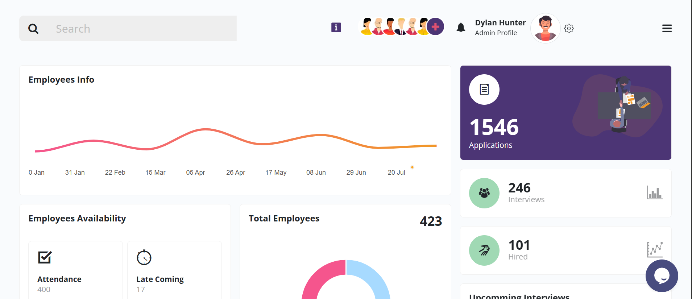

# HR-Portal-PeopleFirst

A modern HR portal designed to streamline people management and HR processes. This project aims to provide an intuitive interface and robust features for HR teams and employees.

## Features
- Employee management
- Leave and attendance tracking
- Payroll integration
- Performance reviews
- And more...

## Getting Started
1. Clone the repository
2. Install dependencies using npm
3. Start the development server

## Folder Structure
- `frontend/` - Frontend assets and resources

## License
[MIT](LICENSE)

## Showcase
This is a showcase project. For more information, please contact info@teks.com.pk.